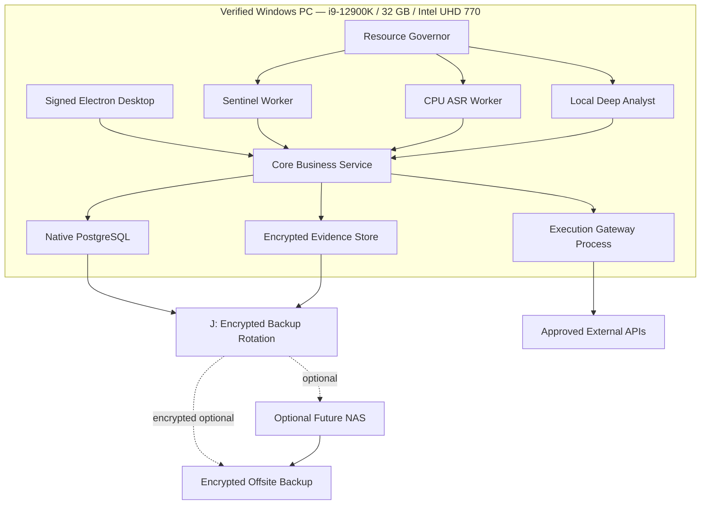

# Phase 8 — Resilience, Final Visual Polish, Scale and Productization Implementation Plan

> **For agentic workers:** REQUIRED SUB-SKILL: Use superpowers:subagent-driven-development (recommended) or superpowers:executing-plans to implement this plan task-by-task. Steps use checkbox (`- [ ]`) syntax for tracking.

**Goal:** Harden the complete system for real shop conditions, unify the final visual experience, prove disaster recovery and security, optimize performance, train users and prepare safe multi-branch/product extraction.

**Architecture:** Preserve the unified interface and modular process boundaries on the verified i9-12900K/32 GB/Intel UHD 770 Windows PC. Core, Sentinel, ASR, Deep Analyst and Gateway are separate native processes on the same machine and are governed by deterministic resource leases. Internet is limited to authorized business-provider APIs and optional encrypted offsite backup; model inference is local only.

**Tech Stack:** Existing stack plus native Windows service packaging, signed installers, OpenTelemetry with bounded PostgreSQL/local metric history, a bundled diagnostics screen, psutil/Windows performance counters, hardware-backed secrets, firewall configuration, UPS/backup-drive monitoring and automated accessibility/performance testing. Docker Desktop, WSL2, Redis, RabbitMQ, Celery, Grafana and cloud-model runtimes are excluded from the target-PC production profile.

**Governing Runtime Design:** `docs/superpowers/specs/2026-07-29-local-cpu-runtime-design.md` applies to every task and acceptance gate.

## Global Constraints

- Existing POS/billing continuity never depends on OMNISCIENCE.
- Recovery is isolated and non-destructive.
- No automatic crypto-shredding or restore-over-production.
- Security claims are measured, not absolute.
- Audio/privacy retention remains enforced during outage.
- Final visuals preserve stable locations and muscle memory.
- Multi-branch isolation is deny-by-default.
- Dealer SaaS may extract shared generic components only; Alhamd private memory, conversations and staff intelligence never leave the private product.
- Every production release is signed, reproducible and rollback-capable.
- Production target is the verified i9-12900K, 32 GB RAM and Intel UHD 770 with no CUDA assumption.
- All AI inference is local, serialized and subject to Resource Governor state.
- Stable Windows 11 Pro, Secure Boot, BitLocker recovery and 16 GB controlled free RAM are production gates.

---

## 1. Final visual vision

The owner experience should feel quiet, decisive and alive:

```text
┌──────────────────────────────────────────────────────────────────────────────┐
│ OMNISCIENCE   LOCAL-ONLY ✓   CORE READY   ANALYST QUEUED   DATA 04m  09:41 │
├──────────┬───────────────────────────────────────────────────────────────────┤
│ NOW      │ GOOD MORNING, MUDASSAR                                            │
│ THINK    │ “Everything important from yesterday is ready.”                   │
│ PEOPLE   │                                                                   │
│ MEMORY   │ RANK 0   None                                                     │
│          │                                                                   │
│          │ APEX TRIAD                                                        │
│          │ 1 Recover 310k before company payment                             │
│          │ 2 Decide A78 shortage campaign                                    │
│          │ 3 Resolve two ownerless launch commitments                        │
│          │                                                                   │
│          │ ALREADY HANDLED                                                   │
│          │ 9 tasks assigned • 4 follow-ups drafted • 2 SOP fixes active      │
├──────────┴───────────────────────────────────────────────────────────────────┤
│ AUTHORITY L4 • EXTERNAL ACTIONS REQUIRE KEY     [SAFE STATE]     09:41:28   │
└──────────────────────────────────────────────────────────────────────────────┘
```

The final system avoids:

- Neon cyberpunk decoration.
- Dense chart museums.
- Generic AI chat as the homepage.
- Endless modal dialogs.
- Hidden risk behind green confidence scores.
- Layout changes that destroy muscle memory.

---

## 2. Production topology



Network zones:

- Owner/staff Windows sessions.
- Local loopback services.
- Office sensors.
- Gateway-only provider egress.
- Customer Wi-Fi.

No customer-Wi-Fi route to server/sensor networks.

---

## 3. Tasks

### Task 1: Establish production hardware and environmental baseline

**Files:**
- Create: `docs/operations/hardware-inventory.md`
- Create: `docs/operations/sensor-map.md`
- Create: `infra/monitoring/hardware_checks.py`
- Test: `infra/monitoring/tests/test_hardware_thresholds.py`

**Interfaces:**
- Produces: daily CPU/iGPU temperature where exposed, RAM, disk free-space/SMART, UPS, backup-drive and sensor status events.

- [ ] Freeze the verified baseline: i9-12900K, 32 GB RAM, Intel UHD 770, `C:` active storage and `J:` encrypted backup rotation.
- [ ] Record current OS channel, Secure Boot, BitLocker, VBS, storage free space, UPS and network assets.
- [ ] Define warning/critical thresholds from vendor specifications.
- [ ] Implement hardware health event generation.
- [ ] Block production signoff on Insider Preview, Secure Boot Off, unverified BitLocker recovery or controlled free RAM below 16 GB.
- [ ] Verify mic gain/coverage does not intentionally target outside premises.
- [ ] Document quarterly dust/filter/battery maintenance.
- [ ] Commit.

### Task 2: Implement network segmentation and egress controls

**Files:**
- Create: `infra/network/segmentation.md`
- Create: `infra/network/firewall-rules.example`
- Create: `tests/security/test_network_boundaries.py`

**Interfaces:**
- Produces: documented VLAN/ACL matrix and automated reachable-port checks.

- [ ] Deny customer network routes to server, database, sensors and Gateway.
- [ ] Permit Gateway egress only to configured provider endpoints.
- [ ] Deny direct AI/Core egress to provider action endpoints.
- [ ] Run port/reachability tests from each network segment.
- [ ] Commit.

### Task 3: Harden endpoint, secrets and signed releases

**Files:**
- Create: `infra/windows/hardening.ps1`
- Create: `infra/release/build-signed.ps1`
- Create: `infra/release/verify-release.ps1`
- Create: `docs/security/release-signing.md`
- Test: `tests/security/test_release_integrity.py`

**Interfaces:**
- Produces: signed installer, signed service artifacts and release manifest.

- [ ] Enable BitLocker, Secure Boot checks, automatic lock and restricted USB policy appropriate to roles.
- [ ] Move provider credentials to OS/hardware-protected vault.
- [ ] Build reproducibly and generate SBOM/hash manifest.
- [ ] Refuse unsigned/tampered release.
- [ ] Commit.

### Task 4: Add complete observability without sensitive leakage

**Files:**
- Create: `packages/observability/src/logging.py`
- Create: `packages/observability/src/metrics.py`
- Create: `packages/observability/src/redaction.py`
- Create: `infra/monitoring/dashboards/system-health.json`
- Test: `tests/security/test_log_redaction.py`

**Interfaces:**
- Produces: correlation-based logs, health metrics and alerts.

- [ ] Test phone, CNIC, bank, raw audio text and secrets do not enter logs.
- [ ] Instrument API latency, event backlog, deletion backlog, model state, Gateway reconciliation and backup age.
- [ ] Instrument available physical RAM, Resource Governor state, heavy-lease owner, worker working sets, AI CPU average and `C:`/`J:` quota state.
- [ ] Retain high-resolution metrics for 24 hours and hourly aggregates for 30 days inside bounded local storage; do not deploy Grafana.
- [ ] Add owner-readable system health; keep developer details separate.
- [ ] Commit.

### Task 5: Implement Fortress safe-state orchestration

**Files:**
- Create: `services/core/app/modules/fortress/service.py`
- Create: `services/core/app/modules/fortress/rules.py`
- Create: `apps/desktop/src/features/fortress/FortressScreen.tsx`
- Test: `tests/acceptance/test_fortress_protocol.py`

**Interfaces:**
- Produces: healthy, degraded, local-only, safe-state and recovery transitions.

- [ ] Test WAN loss, stale financial source, model corruption, provider timeout and owner absence together.
- [ ] Keep existing POS independent.
- [ ] Pause external actions and forecasts requiring stale data.
- [ ] Continue local tasks, evidence and retention.
- [ ] Show exactly what works, stopped and why.
- [ ] Commit.

### Task 6: Complete 3-2-1 backups and non-destructive DR automation

**Files:**
- Create: `infra/dr/backup-production.ps1`
- Create: `infra/dr/restore-clean-room.ps1`
- Create: `infra/dr/reconcile-restore.py`
- Create: `docs/runbooks/disaster-recovery.md`
- Test: `tests/acceptance/test_disaster_recovery.py`

**Interfaces:**
- Produces: encrypted local/NAS/offsite copies and clean-room restore report.

- [ ] Back up database, evidence metadata, encrypted objects, configs and model registry.
- [ ] Verify hash, encryption and restore on schedule.
- [ ] Refuse production target in restore script.
- [ ] Reconcile event counts, evidence objects and provider states before cutover.
- [ ] Conduct quarterly drill and record recovery time/data point.
- [ ] Commit.

### Task 7: Run full red-team and insider-threat review

**Files:**
- Create: `tests/security/red_team/test_prompt_injection.py`
- Create: `tests/security/red_team/test_stolen_session.py`
- Create: `tests/security/red_team/test_gateway_bypass.py`
- Create: `tests/security/red_team/test_db_tamper.py`
- Create: `docs/security/threat-model-final.md`

- [ ] Attempt external-document prompt injection.
- [ ] Attempt stolen staff/owner session escalation.
- [ ] Attempt direct Gateway call without payload-bound approval.
- [ ] Attempt model artifact replacement.
- [ ] Attempt audit/event row tampering.
- [ ] Attempt unauthorized audio playback/export.
- [ ] Record residual risk and remediation; do not claim “unhackable.”
- [ ] Commit.

### Task 8: Performance and offline-tolerance optimization

**Files:**
- Create: `tests/performance/test_owner_now.py`
- Create: `tests/performance/test_customer_workflow.py`
- Create: `tests/performance/test_audio_pipeline.py`
- Create: `apps/desktop/src/app/offlineStore.ts`

**Interfaces:**
- Produces: measured latency budgets and bounded offline queues.

- [ ] Set budgets: owner Now cached render `<1s`, customer search `<1.5s`, task update `<500ms`, Core API p95 `<=500ms`, routine Sentinel p95 `<=5s` after transcript, ten-minute audio `<=15 minutes`, and 500-token Deep Analyst report p95 `<=120s` in Green.
- [ ] Assert process ceilings: UI 750 MB, Core 1 GB, PostgreSQL 3 GB attributable working set, Sentinel 2.5 GB, ASR 4.5 GB and Deep Analyst 8 GB.
- [ ] Exercise Green/Yellow/Orange/Red states and verify exactly one heavy lease.
- [ ] Load-test event ingestion and evidence retrieval.
- [ ] Run a three-hour mixed core/audio/vision/deep-analysis workload and record thermal, RAM, CPU, latency and queue-age evidence.
- [ ] Implement offline-safe internal task updates with conflict resolution.
- [ ] Never queue external actions for blind later execution; expired approvals die.
- [ ] Commit.

### Task 9: Final unified visual polish and interaction consistency

**Files:**
- Modify: `packages/ui-kit/src/tokens.css`
- Create: `packages/ui-kit/src/patterns/DecisionCard.tsx`
- Create: `packages/ui-kit/src/patterns/EvidenceDrawer.tsx`
- Create: `packages/ui-kit/src/patterns/ReviewPriority.tsx`
- Create: `apps/desktop/tests/visual-regression.spec.ts`

**Interfaces:**
- Produces: stable cross-module visual patterns.

- [ ] Audit all screens for semantic color, spacing, typography and action placement.
- [ ] Replace module-specific “confidence” widgets with evidence/uncertainty pattern.
- [ ] Keep destructive actions separated and confirmed.
- [ ] Add empty, loading, stale, degraded, denied and error states.
- [ ] Add `LOCAL ONLY: NO DATA LEAVES THIS PC`, compute state, queued reason, rules-result availability, cancel and run-later states.
- [ ] Run screenshot matrix across target resolutions.
- [ ] Commit.

### Task 10: Accessibility, localization and Roman Urdu resilience

**Files:**
- Create: `packages/ui-kit/src/i18n/catalog.en.json`
- Create: `packages/ui-kit/src/i18n/catalog.ur-Latn.json`
- Create: `apps/desktop/tests/accessibility.spec.ts`
- Create: `docs/product/copy-style.md`

- [ ] Add keyboard-only paths for owner/staff core workflows.
- [ ] Run automated accessibility scan and manual screen-reader smoke test.
- [ ] Ensure money/date/phone formatting and mixed RTL/LTR content remain readable.
- [ ] Define plain-language Roman Urdu operational copy.
- [ ] Commit.

### Task 11: Multi-branch isolation and tenant readiness

**Files:**
- Modify: `services/core/app/modules/authorization/rls.sql`
- Create: `services/core/app/modules/tenancy/service.py`
- Create: `tests/security/test_multi_branch_isolation.py`
- Create: `apps/desktop/src/features/admin/BranchAdmin.tsx`

**Interfaces:**
- Produces: branch-scoped users/data and owner consolidated read model.

- [ ] Test same customer identifiers in different tenants/branches.
- [ ] Deny cross-branch staff access by default.
- [ ] Allow owner consolidated view through explicit aggregate policy.
- [ ] Keep evidence/storage keys tenant-scoped.
- [ ] Commit.

### Task 12: Extract safe shared product kernel for future dealer SaaS

**Files:**
- Create: `docs/productization/shared-vs-private.md`
- Create: `packages/product-kernel/README.md`
- Create: `tests/security/test_private_module_exclusion.py`

**Interfaces:**
- Produces: generic auth, permissions, notification, audit and subscription-ready contracts only.

- [ ] Classify each module as shared-generic or Alhamd-private.
- [ ] Explicitly exclude owner memory, conversations, staff intelligence, private customer relationships and financial awareness data.
- [ ] Add architecture test preventing private module dependency in product kernel.
- [ ] Do not launch SaaS in this task; prepare safe boundary only.
- [ ] Commit.

### Task 13: Build training, adoption and governance program

**Files:**
- Create: `docs/training/owner-guide.md`
- Create: `docs/training/manager-guide.md`
- Create: `docs/training/staff-guide.md`
- Create: `docs/governance/monthly-review.md`
- Create: `apps/desktop/src/features/help/ContextHelp.tsx`

- [ ] Create role-based 30–45 minute training paths.
- [ ] Explain evidence, correction, monitoring, privacy and appeal rights.
- [ ] Run staged adoption scenario including software criticism and usability feedback.
- [ ] Establish monthly policy/model/authority/retention review.
- [ ] Commit.

### Task 14: Complete end-to-end council/owner acceptance

**Files:**
- Create: `tests/acceptance/test_full_business_day.py`
- Create: `apps/desktop/tests/full-owner-day.spec.ts`
- Create: `docs/releases/v1.0-acceptance-report.md`

- [ ] Run morning re-entry and Delta Briefing.
- [ ] Process customer visit, recommendation, lost sale and SOP.
- [ ] Import financial awareness and prepare recovery.
- [ ] Run authorized meeting and review selective audio alert.
- [ ] Demonstrate ASR and Deep Analyst serial execution under Resource Governor control.
- [ ] Approve one safe external message/campaign.
- [ ] Evaluate sealed prediction in shadow.
- [ ] Trigger Fortress mode and recover.
- [ ] End day with Memory Seal.
- [ ] Record owner visual/functional signoff.
- [ ] Commit and tag `v1.0.0-omniscience`.

---

## 4. Final production acceptance gate

### Functional

- All eight phase acceptance suites pass.
- Full owner day can be completed without technical assistance.
- Staff core workflows are usable and role-scoped.
- External actions are payload-bound, approved and reconciled.

### Safety

- No unauthorized external action.
- No source-accounting mutation.
- No raw relevant audio older than policy.
- No irrelevant ambient audio stored.
- No lie/intent/criminal verdict.
- No payment/trading execution capability.
- No self-deploying AI configuration/code.

### Reliability

- POS/billing remains independent during complete OMNISCIENCE outage.
- Fortress state behaves correctly during combined failure.
- Clean-room restore succeeds and live data is not overwritten.
- Backup, deletion and Gateway reconciliation alerts work.
- Native production starts without Docker Desktop, WSL2, Redis, RabbitMQ, Celery or Grafana.
- Green/Yellow/Orange/Red behavior, process ceilings and single-heavy-lease enforcement pass.
- Three-hour mixed-load Core API p95 remains `<= 500 ms`.
- `C:` storage defensive thresholds and `J:` 40 GB backup quota preserve the latest verified restore point.
- No cloud-model credential, hostname or inference request exists.

### Visual

- Owner approves Now, Think, People and Memory experience.
- Stable layout across resolutions.
- Evidence, freshness and authority are visible.
- Customer-facing mode hides sensitive information.
- Accessibility and Roman Urdu content tests pass.

### Governance

- Monitoring policy is operational.
- Role and authority matrix reviewed.
- Model cards and prediction limits visible.
- Monthly governance cadence assigned.
- Residual risks documented honestly.

---

## 5. The finished product

At v1.0, OMNISCIENCE does not attempt to replace Mudassar.

It restores his context, filters noise, strengthens decisions, guides staff, preserves customer and institutional memory, detects material business-relevant risks under controlled policy, prepares approved external actions and learns through measured outcomes.

The final loop is:

```text
signal
→ evidence
→ interpretation
→ bounded recommendation
→ informed human decision
→ controlled execution
→ provider/business readback
→ outcome measurement
→ governed learning
```

The visual experience makes that loop understandable in seconds, while the architecture keeps each capability inside its proven authority.
