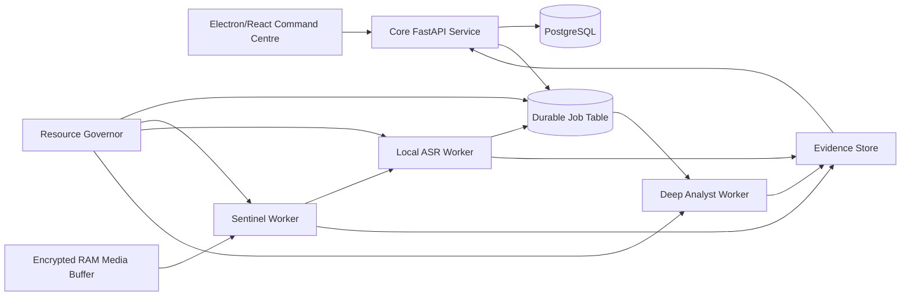

# Project OMNISCIENCE Local CPU Runtime Design

**Date:** 2026-07-29  
**Status:** Approved architecture; governing design for the master specification and all eight implementation phases  
**Decision:** All business reasoning, transcription, conversation analysis and model inference remain on the owner's PC. No cloud LLM or cloud speech/vision inference is permitted.

## 1. Objective

Adapt Project OMNISCIENCE to the owner's real PC without removing the premium Command Centre experience or weakening the safety architecture. The runtime must protect POS, financial awareness, customer operations and the audit spine from AI workload pressure.

The system will use a **Resource-Governed Dual Local Model architecture**:

1. A lightweight Sentinel pipeline performs continuous low-cost detection and extraction.
2. A Deep Analyst model performs selected, queued reasoning only when sufficient resources are available.
3. Core business services remain independent of both AI lanes and always receive higher operating priority.

## 2. Verified Hardware and Runtime Baseline

| Component | Verified state | Architectural consequence |
|---|---|---|
| CPU | Intel Core i9-12900K, 16 cores, 24 logical processors | Strong CPU inference is possible if bounded and serialized. |
| RAM | 32 GB installed | Suitable for one quantized model at a time, not several heavy services in parallel. |
| Observed free RAM | Approximately 9.2–9.7 GB during assessment | Deep reasoning must fail closed under normal current desktop load until other applications release memory. |
| GPU | Intel UHD Graphics 770; no discrete NVIDIA GPU detected | No CUDA design. Intel acceleration may be used only after OpenVINO/ONNX benchmark validation. |
| OS | Windows 11 Pro Insider Preview, build 26220 | Development is acceptable; production requires stable Windows 11 Pro. |
| Secure Boot | Off | Production security gate fails until Secure Boot is enabled and recovery is tested. |
| Virtualization-based security | Running | Preserve it; do not disable it to gain AI performance. |
| `C:` | 485.1 GB total, 177.2 GB free | Application, PostgreSQL, models and active evidence storage. |
| `E:` | 443.2 GB total, 43.4 GB free | Not approved for primary application data. |
| `H:` | 935.3 GB total, 24.4 GB free | Not approved for primary application data. |
| `I:` | 341.7 GB total, 29.3 GB free | Not approved for primary application data. |
| `J:` | 585.4 GB total, 61.0 GB free; labelled Backups Drive | Encrypted rotating local backups only. |

The observed high desktop memory load includes multiple Chrome, ChatGPT, Claude and related processes. The software must measure resources at runtime instead of assuming that 32 GB is available.

## 3. Non-Negotiable Product Behavior

1. POS, financial awareness, inventory, customer records, tasks, promises, evidence, audit and recovery drafting do not depend on an AI model.
2. Raw audio, video, transcripts, owner memory and business context never leave the local machine for AI inference.
3. No outbound cloud-model API key exists in the runtime.
4. AI workers may be paused or killed without corrupting the core database or blocking the interface.
5. Heavy AI concurrency is exactly one.
6. A degraded answer is never disguised as a complete answer.
7. The visual design remains the approved premium Command Centre; hardware adaptation is visible through honest status states, not a reduced interface.

## 4. Runtime Architecture

### 4.1 Core Business Lane

Runs as native Windows services and remains available in every resource state.

- Electron/React single-window desktop application with lazy-loaded routes.
- Modular FastAPI core service.
- Native PostgreSQL service as durable source of truth.
- PostgreSQL transactional outbox and durable job table.
- Local encrypted evidence storage.
- Windows authentication/FIDO2 boundaries defined by the master specification.

The core lane cannot load a language, speech or vision model into its process.

### 4.2 Sentinel Lane

Performs low-cost continuous work:

- Voice activity detection.
- Denoising and acoustic-zone checks.
- Deterministic business keyword/entity detection.
- Amount, deadline, task, promise and commitment extraction.
- Privacy redaction for UI and evaluation exports.
- Lightweight multilingual embeddings when benchmarked within budget.
- Business relevance and adoption-resistance triage.
- Evidence indexing and priority routing.

Rules and small classifiers handle routine work. A quantized local model in the 1.5B–3B class may be used only if it beats the rules baseline on the frozen Roman Urdu evaluation set.

### 4.3 Local ASR Lane

- Uses a CPU-optimized, quantized speech-to-text runtime.
- Begins with a small multilingual model and integer quantization.
- Runs one transcription job at a time.
- Uses bounded rolling chunks rather than keeping an entire day in memory.
- Preserves timestamps and confidence for evidence linking.
- Does not claim speaker identity; diarization uses anonymous local session labels.
- May use Intel iGPU/OpenVINO acceleration only after the same test corpus proves lower latency without accuracy or stability regression.

### 4.4 Deep Analyst Lane

Performs selected reasoning:

- Conversation and meeting summaries.
- Evidence conflict analysis.
- Contradiction comparison.
- Unresolved commitment detection.
- Suggested owner questions.
- Decision Chamber and pre-mortem work.
- Overnight pattern review.
- Owner memory synthesis.

The runtime begins with a quantized multilingual 3B–4B candidate. A 7B quantized model is an optional overnight candidate, not a production assumption. Model selection is based on Roman Urdu/Urdu/English accuracy, memory use, latency and hallucination tests on this exact PC.

Deep analysis is queued and interruptible. It has no execution authority.

## 5. Resource Governor

The Resource Governor is a non-AI Windows service. It reads available physical memory, CPU load, core API latency, disk free space, worker heartbeat and thermal telemetry where available.

### 5.1 Memory states

| State | Available physical RAM | Allowed work |
|---|---:|---|
| Green | `>= 16 GB` | One Deep Analyst or one ASR job; never both heavy jobs concurrently. |
| Yellow | `12–15.9 GB` | One medium ASR or Sentinel batch; Deep Analyst remains queued. |
| Orange | `8–11.9 GB` | Sentinel/rules only; ASR limited to short urgent chunks; no language model. |
| Red | `< 8 GB` | Core Business Lane only; all AI jobs remain durable and queued. |

Pagefile capacity does not count as available model memory.

### 5.2 CPU and responsiveness

- AI worker process priority: Below Normal.
- Core API and PostgreSQL priority: Normal.
- Combined AI CPU ceiling: 60% averaged over 30 seconds.
- If core API p95 latency exceeds 500 ms for 30 seconds, current AI work pauses.
- If UI heartbeat is absent for five seconds, consequential actions lock and AI work pauses.
- If a POS/import/reconciliation job starts, Deep Analyst yields immediately.
- If thermal telemetry crosses the motherboard's warning state, all model inference stops.

### 5.3 Process memory budgets

| Component | Steady target | Hard ceiling |
|---|---:|---:|
| Electron UI | 450 MB | 750 MB |
| Core API | 500 MB | 1 GB |
| PostgreSQL working set attributable to OMNISCIENCE | 1.5 GB | 3 GB |
| Sentinel worker | 1 GB | 2.5 GB |
| ASR worker | 2.5 GB | 4.5 GB |
| Deep Analyst worker | 5 GB | 8 GB |

Crossing a worker ceiling terminates that worker, records an incident and safely requeues the job once. A second identical failure moves the job to manual review.

## 6. Audio and Vision Design

### 6.1 Audio

- Audio enters an encrypted in-memory ring buffer.
- Voice activity and relevance checks occur before disk persistence.
- Irrelevant audio is discarded and never written to disk.
- Relevant clips use encrypted mono Opus.
- Default raw relevant-clip retention is 72 hours.
- Total audio quota is 10 GB.
- Deletion worker failure creates a Rank 0 privacy incident and stops new recording.

### 6.2 Camera

- No continuous high-frame-rate inference.
- Authorized meeting mode samples at 1–2 FPS.
- Processing is limited to observable pose/gaze/head-motion landmarks and scene quality.
- Raw video is not retained by default.
- A thumbnail may be preserved only with explicit meeting consent and evidence purpose.
- Body/face signals cannot produce a deception, criminal-intent, loyalty or punishment decision.
- Camera work pauses whenever ASR or Deep Analyst needs the heavy slot.

## 7. Storage Layout and Quotas

### 7.1 `C:` active storage

| Category | Quota |
|---|---:|
| Installed application and runtime | 8 GB |
| Local model artifacts | 15 GB |
| PostgreSQL active database | 30 GB initial ceiling |
| Relevant audio clips | 10 GB |
| Evidence, logs and thumbnails | 10 GB |
| Update/rollback reserve | 10 GB |

The system warns at 30 GB free, enters storage defensive mode at 20 GB free and blocks recording/model downloads at 15 GB free.

### 7.2 `J:` backup storage

- Encrypted rotating local backups only.
- Maximum active backup allocation: 40 GB.
- Retain one latest daily, one weekly and one verified restore artifact within quota.
- Backup creation fails safely when the quota cannot preserve the latest verified restore point.
- `E:`, `H:` and `I:` are not automatic spillover targets.

Offsite backup remains separately encrypted and optional, but it may contain encrypted backups only—not cloud AI processing.

## 8. Dependency Simplification

The initial production runtime excludes:

- Always-on Docker Desktop.
- Always-on WSL2.
- Redis.
- RabbitMQ.
- Celery.
- Neo4j.
- Milvus, Pinecone or another standalone vector database.
- Grafana.
- Local Kubernetes.
- Multiple simultaneous local LLM servers.

Replacements:

- Native Windows services.
- Python packaged environments.
- PostgreSQL durable jobs, advisory locks, outbox and graph-like relations.
- PostgreSQL vector extension only if the measured query need justifies it.
- Built-in diagnostics and bounded local metric history.

Docker may be used manually in development or CI, but it is not required for daily operation.

## 9. Data Flow

### 9.1 Conversation event

1. Microphone writes a short frame to encrypted RAM.
2. Sentinel detects voice, zone and business relevance.
3. Irrelevant frame is destroyed.
4. Relevant frame is encoded as encrypted Opus and queued.
5. Resource Governor grants ASR only when allowed.
6. ASR writes timestamped anonymous transcript segments.
7. Deterministic extraction creates commitments, amounts and evidence conflicts.
8. Routine results appear immediately.
9. High-value analysis becomes a Deep Analyst job.
10. Deep Analyst runs only in Green state and writes a structured result linked to evidence.
11. Raw clip expires within 72 hours unless the owner explicitly preserves it with a reason.

### 9.2 Owner reasoning request

1. Owner opens Decision Chamber or selects “Analyze deeply.”
2. Core service creates a durable job and displays its estimated operating state.
3. Resource Governor either starts it or explains why it is queued.
4. Deep Analyst receives only locally retrieved permitted context.
5. Structured result passes schema, citation and uncertainty checks.
6. UI shows evidence, assumptions, missing data and model/version information.
7. No recommendation can directly call an external action gateway.

## 10. Degradation and Error Handling

| Failure | Required behavior |
|---|---|
| Low RAM | Queue AI; keep core software fully usable. |
| High CPU/core latency | Pause or terminate the AI worker; preserve job state. |
| Model load failure | Fall back to deterministic output and mark deep analysis unavailable. |
| ASR backlog | Prioritize owner-requested/meeting segments; show backlog age; never drop silently. |
| Disk defensive state | Stop new raw recording and model downloads; preserve database and deletion service. |
| Worker crash | Requeue once; repeated crash enters manual review. |
| Power loss | PostgreSQL/outbox recovery; incomplete media chunk is discarded; no destructive repair. |
| Internet loss | No AI impact; external provider integrations queue or fail closed. |
| Camera unavailable | Audio/text workflow continues and says visual evidence unavailable. |
| Deletion worker failure | Stop capture and raise Rank 0 privacy incident. |

## 11. Visual Runtime States

The premium Command Centre retains the established visual language and adds a restrained local-compute status:

- `CORE: READY`
- `SENTINEL: ACTIVE`
- `TRANSCRIPTION: 2 QUEUED`
- `DEEP ANALYST: WAITING FOR 16 GB FREE RAM`
- `LOCAL ONLY: NO DATA LEAVES THIS PC`

The interface must never show a generic spinner for queued local reasoning. It shows:

1. Why the job is waiting.
2. Current RAM/CPU state.
3. Whether a rules-based answer is already available.
4. Cancel and run-later controls.

## 12. Model Benchmark and Acceptance

No model name is permanently selected in the architecture document. Every candidate must run on this PC against a frozen local evaluation set.

### 12.1 Evaluation set

- Roman Urdu shop conversations.
- Urdu/English code-switching.
- Khanewal names, brands, amounts and dates.
- Overlapping speakers.
- Background market/traffic noise.
- Software adoption criticism.
- Promises and later contradictions.
- Jokes, sarcasm and ambiguous statements.
- Explicitly irrelevant conversations.

### 12.2 Gates

- Critical entity accuracy `>= 0.90`.
- Adoption-resistance precision `>= 0.80`.
- Critical business-risk precision `>= 0.90`.
- No prohibited deception/criminal-intent verdict.
- Ten-minute audio batch completes in `<= 15 minutes` in Green state.
- Routine Sentinel result p95 `<= 5 seconds` after transcript availability.
- A 500-token Deep Analyst report p95 `<= 120 seconds` in Green state.
- Core API p95 remains `<= 500 ms`.
- Zero POS/import/reconciliation failures during a three-hour mixed-load test.
- Peak OMNISCIENCE working set remains within documented ceilings.

If the 7B candidate fails latency or memory gates, it is excluded. The system remains valid with the smaller Deep Analyst candidate.

## 13. Production Readiness Gates

Before owner production use:

1. Move from Windows Insider Preview to stable Windows 11 Pro.
2. Enable Secure Boot.
3. Enable and verify BitLocker recovery.
4. Keep virtualization-based security enabled.
5. Demonstrate at least 16 GB available RAM in the controlled AI operating profile.
6. Complete CPU thermal stress test.
7. Complete three-hour audio/ASR/Deep Analyst mixed-load test.
8. Complete POS latency and database integrity test during AI load.
9. Complete sudden power-loss and isolated restore test.
10. Confirm `C:` and `J:` quota/retention behavior.

## 14. Upgrade Path

A future discrete GPU is optional, not required for the baseline product. If added:

- It becomes a new worker capability, not a rewrite.
- The Resource Governor retains authority.
- CPU-safe models remain rollback options.
- GPU model promotion requires the same frozen evaluation and failure-day tests.
- Core Business Lane remains GPU-independent.

## 15. Final Decision

Project OMNISCIENCE will be designed for the current i9-12900K/32 GB/Intel UHD 770 machine as a local-first, CPU-bounded system. It will favor deterministic rules, serialized jobs, quantized models and honest degraded states over simultaneous “always intelligent” processing.

This constraint changes runtime scheduling and model ambition—not the product's visual quality, evidence discipline or operational scope.
