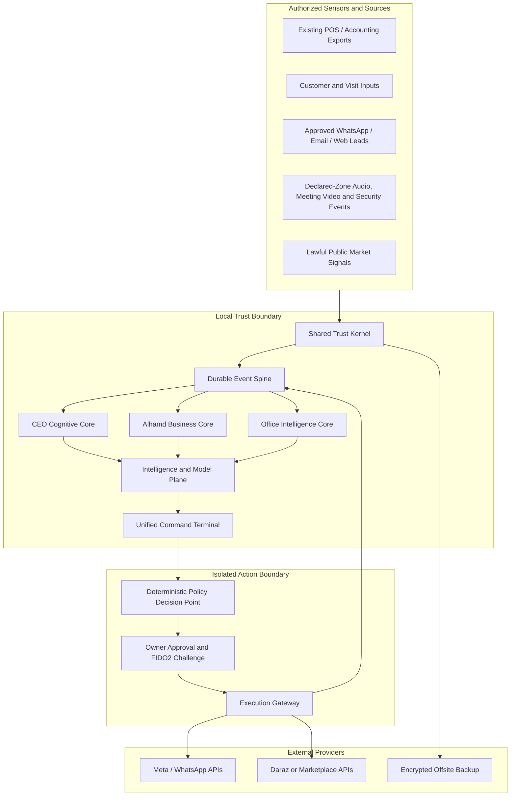
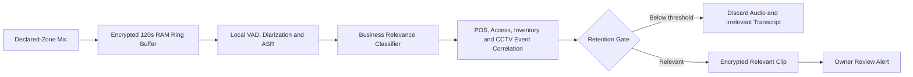

# Project OMNISCIENCE

## Master Product and Technical Specification

**Product:** Alhamd Intelligence, Execution and CEO Cognitive System  
**Architecture:** Option B — Unified Interface with Modular Twin-Core Backend  
**Version:** 1.1 — Local CPU Runtime Revision  
**Date:** 29 July 2026  
**Status:** Product architecture approved; implementation has not started  
**Primary owner:** Mudassar Ali, Alhamd Telecom  

---

## 1. Purpose of this document

This document converts the approved ideas from the two original approaches and the later technical audits into one buildable software specification.

It defines:

- What the software will and will not do.
- Which features are authorized now.
- Which features require shadow testing before activation.
- Which capabilities are permanently prohibited.
- How data, authority, security, privacy and evidence will work.
- What the first 90-day MVP contains.
- How the product can grow without turning into an unsafe monolith.

This is the master product specification. Individual implementation epics should later receive their own engineering plans, schemas, API contracts and test cases.

---

## 2. Final product definition

Project OMNISCIENCE is a local-first, evidence-driven system that combines:

1. **A CEO Cognitive Core** that restores context, protects attention, improves decisions, preserves ideas and prepares the owner for meetings.
2. **An Alhamd Business Core** that helps the team acquire, convert, retain and serve customers while making execution measurable.
3. **An Office Intelligence Core** that turns authorized conversations and business events into commitments, risks, tasks and institutional knowledge.
4. **A Shared Trust Kernel** that controls identity, permissions, evidence, provenance, approvals, retention and audit.
5. **An Isolated Execution Gateway** that performs only explicitly approved external actions through supported APIs.

The product is not:

- An accounting replacement.
- A guaranteed-profit prediction machine.
- A lie detector.
- A keylogger.
- An autonomous bank-transfer or trading bot.
- An automatic employee punishment system.
- A hidden competitor-surveillance or hacking tool.
- A self-rewriting production system.

### 2.1 North-star objective

> Make Alhamd Telecom the fastest-learning, most trusted and most consistently executing mobile dealership in its market, while reducing the owner's cognitive load and preserving human control over consequential decisions.

### 2.2 Primary outcomes

- **Owner liberation:** Routine information becomes ranked decisions and exceptions.
- **Execution certainty:** Every important commitment has an owner, deadline, evidence and escalation path.
- **Customer compounding:** Customers become long-term relationships rather than one-time invoices.
- **Commercial intelligence:** Sales, lost sales, demand, bundles and campaigns become learning signals.
- **Financial awareness:** Existing accounting data becomes daily recovery and payment intelligence without replacing the accounting system.
- **Institutional memory:** Knowledge remains inside the business when employees leave.
- **Capital protection:** No AI component can independently move money or create an unbounded external commitment.
- **Sukoon:** At the end of the day, unresolved thoughts and commitments are safely captured for tomorrow.

---

## 3. Locked architectural decisions

These decisions are mandatory unless the owner formally revises this specification.

1. The user sees one unified PC application.
2. The backend is modular; sensitive domains do not share unrestricted authority.
3. The existing POS/accounting software remains the financial source of truth.
4. OMNISCIENCE receives accounting information through read-only API, export or a controlled daily template.
5. Daraz receives no more than approximately 10% of initial product attention.
6. Billing and existing store operations must continue if OMNISCIENCE is unavailable.
7. External messages, ads, price changes and customer promises require informed human approval.
8. Payments, transfers and investment execution are outside OMNISCIENCE authority.
9. Predictions are probabilistic and carry uncertainty; they never guarantee profit.
10. Audio/video features operate only in declared business zones with a visible policy and retention controls.
11. Raw relevant audio is retained for a maximum of 72 hours by default.
12. Irrelevant ambient audio is processed locally and discarded without being written to permanent storage.
13. Keystrokes are never globally recorded.
14. Screen continuity captures approved application state, not passwords, OTPs, banking screens or unrestricted raw screen video.
15. AI may propose model, prompt or weight changes but may not deploy them to production.
16. All consequential actions pass through deterministic policy rules and an isolated execution boundary.
17. A kill switch stops outbound activity; it never deletes data or destroys encryption keys.
18. Disaster recovery is deliberate, verified and non-destructive.
19. All LLM, speech, embedding and vision inference runs locally on the owner's PC; no cloud-model inference is permitted.
20. The verified baseline is an Intel Core i9-12900K, 32 GB RAM and Intel UHD 770 without a discrete NVIDIA GPU.
21. Core business services always outrank AI work; the Resource Governor may pause every AI worker without blocking POS-facing workflows.
22. Exactly one heavy local AI job may run at a time.

---

## 4. System constitution

### 4.1 Evidence and truth

- Every material number must have a source, timestamp, freshness status and responsible source system.
- AI text is not evidence.
- A public post, supplier message or employee report is a claim until independently verified.
- Every important recommendation must expose its evidence and uncertainty.
- Contradictory records must remain visible; the system may not silently overwrite the inconvenient record.
- Historical predictions and decisions are append-only. Corrections create a new linked record.

### 4.2 Authority

- Observation, calculation, recommendation, approval and execution are separate permissions.
- Model confidence alone never grants execution authority.
- Financial, legal, reputational and employee consequences remain human-controlled.
- Low-risk internal workflow automation may earn bounded authority through demonstrated performance.
- Authority promotion requires owner approval; safety-triggered demotion may happen automatically.

### 4.3 People

- Staff performance is evaluated against opportunities, role expectations and verified outcomes, not facial expressions or private opinions.
- Criticism of software is not sabotage.
- A business-risk conversation becomes actionable only when supported by operational context or objective evidence.
- Employee discipline, salary changes, hiring and firing are never automated.

### 4.4 Data minimization

- Collect only what a defined feature needs.
- Retain raw data for the shortest useful period.
- Sensitive raw data and AI inference inputs remain local without a cloud-model exception.
- Private zones, personal accounts, passwords and unrelated conversations are excluded.
- Every retained audio/video item must have a reason, retention deadline and access log.

### 4.5 Claims the product may make

Allowed:

- “Evidence conflict detected.”
- “This promise changed twice.”
- “This forecast was calibrated on 180 historical cases.”
- “This campaign produced an estimated incremental lift.”
- “This conversation may require verification.”

Prohibited:

- “This person is definitely lying.”
- “This prediction cannot lose.”
- “The software generated exactly this much profit” without a causal design.
- “The system is unhackable.”
- “No data can ever be lost.”

---

## 5. Product boundaries

### 5.1 In scope

- CEO context, memory, decision and meeting assistance.
- Customer relationship intelligence.
- Guided sales workflows and next-best actions.
- Lost-sale and demand intelligence.
- Product-launch operations.
- Trust, loyalty, referral and benefit management.
- Accessory and bundle recommendations.
- Installment workflow assistance.
- Staff tasking, evidence-based SOPs and coaching.
- Institutional knowledge capture.
- Read-only daily financial awareness and recovery workflows.
- Dynamic customer/vendor risk tiers with human review.
- Market opportunity signals from lawful, authorized sources.
- Approved advertising and messaging workflows.
- Business experiments and measured lift estimates.
- Authorized office conversation analysis.
- Declared-zone business-relevance and anti-theft audio alerts.
- Probabilistic forecasting in shadow mode.
- Controlled overnight analysis and drafting.
- Security, audit, backups and disaster recovery.

### 5.2 Out of scope

- Native bookkeeping, journal entry, general ledger, balance sheet or tax filing.
- Autonomous payment or bank API execution.
- Automatic investment, cryptocurrency, forex, CFD or stock trading.
- Hidden stock discovery inside competitor premises or systems.
- Private-chat interception or unrestricted scraping.
- Global employee keystroke capture.
- Covert recording outside declared premises.
- Automatic lie, intent, emotion or criminality verdicts.
- Automatic permanent blacklists.
- Autonomous disciplinary or legal actions.
- Production code or policy self-modification.
- Smart glasses as a required operational interface.

---

## 6. Users and role boundaries

### 6.1 Owner / CEO

Can:

- See all owner-authorized business domains.
- Approve sensitive external actions.
- Override risk tiers with a reason.
- Preserve or delete relevant evidence clips.
- Change policies through authenticated administration.
- Review predictions, decisions and model performance.

Cannot:

- Bypass immutable audit history.
- Convert an AI suspicion into a system-certified fact.

### 6.2 Manager

Can:

- Assign and verify tasks.
- Review SOP evidence.
- Resolve non-financial disputes within configured limits.
- Approve low-risk internal workflow actions.

Cannot:

- Approve payments, policy changes or high-risk customer actions unless explicitly delegated.

### 6.3 Sales staff

Can:

- View their next-best-action workspace.
- Register customers, visits, lost sales, objections and follow-ups.
- Complete tasks with required evidence.
- Access assigned product and customer context.

Cannot:

- View owner memory, broad financial exposure, other employees’ private coaching or restricted customer records.

### 6.4 Accountant / financial operator

Can:

- Submit or validate read-only daily exports.
- Tag unidentified inflows/outflows.
- Mark disputes and reconciliation issues.

Cannot:

- Change OMNISCIENCE historical audit events.
- Use OMNISCIENCE to post into the accounting system.

### 6.5 Marketing operator

Can:

- Prepare content, audiences and campaigns.
- Review attributed leads and campaign results.

Cannot:

- Publish, increase budget or make a price promise beyond assigned approval limits.

### 6.6 Developer / system administrator

Can:

- Maintain infrastructure and deploy signed releases.
- Access technical logs with sensitive fields redacted.

Cannot:

- See decrypted customer/owner content by default.
- approve business transactions.
- alter audit history.

### 6.7 AI agents

Each AI agent has:

- An explicit data scope.
- Allowed tools.
- Prohibited actions.
- A model and prompt version.
- Confidence and evidence requirements.
- A maximum authority level.
- Full activity logging.

---

## 7. High-level architecture



### 7.1 Shared Trust Kernel

Owns:

- Identity and authentication.
- Roles and attributes.
- Branch, department and data-domain boundaries.
- Source registry.
- Consent and declared monitoring zones.
- Audit records.
- Evidence metadata.
- Retention policies.
- Approval challenges.
- Policy versions.
- Model and prompt versions.
- Cryptographic hashes.

### 7.2 Durable Event Spine

Every material action becomes a durable event before downstream processing.

Minimum event fields:

```text
event_id
event_type
occurred_at
recorded_at
actor_id
source_system
source_record_id
branch_id
data_classification
payload_schema_version
payload_hash
correlation_id
causation_id
evidence_ids[]
retention_policy_id
```

PostgreSQL is the durable source and baseline authority for jobs, outbox delivery and advisory locks. Redis is excluded from the verified current-PC production profile.

### 7.3 CEO Cognitive Core

Owns private owner context, decisions, thoughts, meetings, relationships and cognitive workflows.

### 7.4 Alhamd Business Core

Owns customer growth, sales execution, staff workflows, market learning, SOPs, recoveries and operational awareness.

### 7.5 Office Intelligence Core

Owns authorized transcription, business-relevance detection, meeting observations and source clips.

### 7.6 Intelligence and Model Plane

Produces analysis and recommendations. It has no external API credentials and no direct write access to external systems.

### 7.7 Execution Gateway

Receives only policy-approved, human-bound action payloads. It holds narrowly scoped external credentials and implements:

- Payload schema validation.
- Price/budget/recipient limits.
- Nonce and expiry validation.
- Idempotency.
- Rate limits.
- Provider readback.
- Reconciliation.

---

## 8. Shared Trust Kernel requirements

### TK-01 Identity and authentication

- Owner uses FIDO2/YubiKey or Windows Hello for sensitive actions.
- Staff use individual accounts; shared credentials are prohibited.
- Sessions expire after configurable inactivity.
- Level 4+ actions require reauthentication.
- Recovery credentials are held separately from everyday credentials.

### TK-02 Authorization

Use:

- Role-based access control for normal permissions.
- Attribute-based rules for branch, department, customer segment and data sensitivity.
- Row-level database policies for restricted records.
- Temporary delegation with start/end time and explicit scope.

### TK-03 Evidence lineage

Every insight card must be able to show:

- Original source.
- Acquisition method.
- Timestamp and freshness.
- Transformations applied.
- Human corrections.
- Model/rule version.
- Confidence and uncertainty.

### TK-04 Evidence grades

| Grade | Meaning | Examples | Execution use |
|---|---|---|---|
| A | Direct authoritative record | POS record, provider readback, signed document | May support owner-approved action |
| B | Strong authenticated internal evidence | authenticated staff input plus supporting document | Requires owner/manager review |
| C | Unverified single-source claim | supplier message, customer report | Recommendation only |
| D | Weak, stale or contradictory signal | old public post, ambiguous audio | No action; verification required |

Evidence grade is not a truth guarantee.

### TK-05 Tamper evidence

- Append-only event rows.
- Hash chaining of critical decision/prediction records.
- Daily signed manifest stored separately.
- Database permissions prevent the application from updating sealed records.
- Tampering generates an incident; it does not automatically destroy or freeze unrelated store operations.

### TK-06 Consent and monitoring zones

Each monitored zone records:

```text
zone_id
physical_location
purpose
allowed_sensors
visible_notice_required
authorized_hours
raw_retention_hours
review_roles
excluded_areas
policy_version
```

Washrooms, prayer/rest areas and spaces with a reasonable expectation of privacy are permanently excluded.

### TK-07 Retention engine

- Every object has `expires_at`.
- Deletion workers run at least hourly.
- Deletion failures alert the owner.
- Legal/evidence preservation requires an owner reason and new expiry.
- Deletion events are logged without retaining the deleted content.

---

## 9. CEO Cognitive Core

### CEO-01 Arrival and Re-Entry Capsule

When the owner starts the application, it offers:

- Last unresolved thoughts.
- Pending decisions.
- People awaiting a response.
- Open documents/workspaces from approved applications.
- Last conclusion, uncertainty and intended next step.
- A one-click workspace restore.

Presence detection may use owner login, workstation unlock or optional authorized face recognition. Face recognition is for identity/access only, not emotion inference.

### CEO-02 Delta Briefing

The briefing shows only changes since the owner last reviewed the system:

1. What became better?
2. What became worse?
3. What surprised us?
4. What requires an owner decision?
5. What can be ignored?
6. What opportunity appeared?
7. What should the owner not do today?

Every briefing item links to evidence.

### CEO-03 Cognitive Mode Selector

Modes:

- **Commander:** decisions, delegation and approvals.
- **Creator:** ideas, campaigns, offers and strategy.
- **Deep Work:** one problem, minimal interruptions.
- **People:** meetings, coaching and relationships.
- **Recovery:** essential decisions only.

The mode changes information density, notifications and available workflows. It does not secretly infer the owner's mood.

### CEO-04 Attention Firewall

Staff escalations require:

```text
situation
business_impact
actions_already_attempted
available_options
recommended_option
decision_deadline
supporting_evidence
```

Routing:

- Immediate: irreversible, safety, legal or high-value deadline.
- Decision batch: important but delay-tolerant.
- Delegate: another authorized role can decide.
- Return for information: submission is incomplete.

Emergency safety alerts bypass scoring.

### CEO-05 Interruption Recovery Capsule

For whitelisted applications only, the system stores:

- Current document or internal screen.
- Last saved sentence or note.
- Pending question.
- Intended next step.
- Related sources.

It does not record global keystrokes, password fields, private banking screens or unrestricted screen video.

### CEO-06 Thought Capture

Owner voice/text fragments are converted into:

- Observation.
- Hypothesis.
- Question.
- Experiment.
- Decision candidate.
- Related prior idea.
- Required evidence.

The owner approves long-term memory publication.

### CEO-07 Thought Extension

The assistant challenges ideas with structured prompts:

- Strongest version.
- Hidden assumption.
- Opposite strategy.
- Copyability and moat.
- Ten-times-scale consequence.
- Evidence needed.

It must not simply agree with the owner.

### CEO-08 Contradiction Engine

Detects:

- Conflicting priorities.
- New plans conflicting with existing commitments.
- Repeatedly postponed decisions.
- Changed standards.
- Claims broader than available evidence.

It displays the two source statements and asks whether circumstances changed.

### CEO-09 Decision Chamber

Every high-stakes decision contains:

```text
objective
facts
assumptions
unknowns
options
expected_value_range
maximum_credible_downside
reversibility
opportunity_cost
second_order_effects
stakeholders
pre_mortem
review_conditions
decision_owner
review_date
```

Multiple AI perspectives may be used, but diversity of models is not treated as independent proof. The final result is advisory.

### CEO-10 Future-Self Council

Structured perspective simulation:

- 30-day owner.
- One-year owner.
- Ten-times-scale business.
- Future customer.
- Future employee.
- Future competitor.

The interface labels these as simulations, not predictions.

### CEO-11 Pre-Mortem Simulator

Assumes the initiative failed and generates:

- Likely failure causes.
- Early warning indicators.
- Preventive controls.
- Rollback conditions.
- Responsible monitors.

### CEO-12 Decision Journal and Calibration

Records:

- Expected outcome.
- Probability or range.
- Assumptions.
- Warning signs.
- Review date.
- Actual outcome.
- Error and root cause.

It measures owner/model calibration without rewriting past predictions.

### CEO-13 Meeting Pre-Brief

Before an important meeting:

- Purpose.
- Person/relationship context.
- Previous commitments.
- Unresolved issues.
- Questions to ask.
- Sensitive points.
- Decisions to avoid prematurely.
- Desired outcome.

### CEO-14 Live Meeting Copilot

For explicitly authorized meetings:

- Speaker separation.
- Urdu/Roman Urdu/English transcription.
- Topic drift detection.
- Unanswered-question detection.
- Contradiction detection.
- Vague commitment detection.
- Missing owner/deadline detection.
- Private prompts to the owner.

No automatic message or decision leaves the meeting.

### CEO-15 Promise Graph

Tracks:

- Promises made by owner.
- Promises made to owner.
- Team commitments.
- Customer/vendor commitments.
- Conditional promises.
- Repeatedly delayed promises.

Every promise has owner, counterparty, due date, evidence and next action.

### CEO-16 Delegation Compiler

Converts vague instruction into:

```text
desired_outcome
reason
responsible_person
first_action
deadline
resources
authority_boundary
definition_of_done
required_evidence
escalation_condition
success_metric
```

### CEO-17 Delegation Confidence Ladder

Employee authority:

- L0 Observe.
- L1 Summarize.
- L2 Recommend.
- L3 Draft or prepare.
- L4 Execute after approval.
- L5 Execute and immediately report.
- L6 Execute independently inside narrow limits.

Promotion requires owner approval and verified historical performance.

### CEO-18 Creativity Collider

Combines real Alhamd context:

- Complaint.
- Lost sale.
- Competitor offer.
- Old idea.
- Product capability.
- Staff observation.
- Trust benefit.

Outputs a testable concept, not just idea lists.

### CEO-19 Opportunity Archaeologist

Revisits rejected ideas when their blocking condition changes.

### CEO-20 Pattern Memory

For a current situation, retrieves:

- Similar prior case.
- Prior decision.
- Outcome.
- Lesson.
- What is materially different now.

### CEO-21 Private Rehearsal Studio

Simulates difficult conversations with:

- Customer.
- Employee.
- Supplier.
- Company representative.
- Price-sensitive buyer.

Provides feedback without sending anything externally.

### CEO-22 Relationship Compass

Shows:

- Neglected strategic relationships.
- Contact that is purely transactional.
- Unresolved promises.
- Unusual silence.
- Appropriate non-sales follow-up.

### CEO-23 Cognitive Load Balancer

Classifies decisions as analytical, creative, emotional, repetitive, people-sensitive, reversible or high-stakes and recommends timing.

### CEO-24 Reality-versus-Story Detector

Separates:

- Verified fact.
- Assumption.
- Interpretation.
- Fear.
- Prediction.
- Anecdote.

### CEO-25 Nocturnal Sentinel

Overnight allowed:

- Analyze.
- Reconcile read-only data.
- Organize thoughts.
- Prepare meetings.
- Draft content/messages.
- Find contradictions.
- Generate questions.
- Compile morning briefing.

Overnight prohibited:

- Send messages.
- Launch ads.
- Change prices.
- Move money.
- Make commitments.
- Publish model/config changes.

### CEO-26 End-of-Day Memory Seal

Five-minute closure:

- What was decided?
- What changed?
- What remains unresolved?
- What was learned?
- What should not occupy the owner tonight?
- Where should work restart tomorrow?

---

## 10. Alhamd Business Core

### BIZ-01 Customer Intelligence Engine

Customer profile:

- Current and previous devices.
- Purchase and visit history.
- Budget and payment preference.
- Brand/model preferences.
- Installment status.
- Household relationships with consent.
- Objections.
- Accessories.
- Trust/loyalty entitlements.
- Complaints and resolution.
- Upgrade window.
- Referral history.
- VIP status.
- Last meaningful contact.
- Recommended next action.

Predictions remain probabilistic and are evaluated against actual outcomes.

### BIZ-02 Intelligent Sales Workspace

For each active customer/lead:

- Questions to ask.
- Three relevant device comparisons.
- Customer-specific benefits.
- Likely objections and approved responses.
- Installment options.
- Trust benefits.
- Accessory bundle.
- Alternative if unavailable.
- Minimum approved commercial boundary.
- Required follow-up.

AI supports the salesperson; it does not impersonate or replace them.

### BIZ-03 Lost-Sale Intelligence

Required fields:

```text
customer_or_anonymous_visit
requirement
interested_model
quoted_price
competitor_alternative
reason_lost
objection
staff_member
stock_status
installment_status
follow_up_possible
estimated_margin_range
```

Weekly outputs:

- Price, stock, pitch or process causes.
- Latent demand.
- Recoverable leads.
- Frequently winning competitor alternatives.
- Product and training gaps.

### BIZ-04 Product and Demand Intelligence

Read-only product/stock inputs become recommendations:

- Fast/slow movement.
- Potential stockout.
- Dead inventory.
- Repeated unavailable requests.
- Substitution opportunities.
- Price sensitivity.
- Segment demand.
- Launch demand.
- Accessory linkage.

Outputs:

- Push.
- Protect.
- Reorder recommendation.
- Bundle.
- Stop promoting.
- Investigate.

No automatic purchase order or payment is created.

### BIZ-05 Product Launch War Room

Before launch:

- Waitlist.
- Upgrade candidates.
- VIP previews.
- Staff certification.
- Competitor/public offer tracking.
- Content preparation.
- Demo readiness.
- Pre-booking pipeline.

During launch:

- Leads, conversion, stock, objections, installment demand, bundles and lost opportunities.

After launch:

- Conversion analysis.
- Forecast review.
- Customer feedback.
- Best/failed pitch.
- Follow-up campaign.

### BIZ-06 Trust Premium and Loyalty OS

Each benefit/pillar has:

```text
name
eligibility
duration
customer_entitlement
store_liability
redemption_conditions
approval_requirement
estimated_cost
utilization
retention_effect
profitability_estimate
```

Known examples include Perpetual Cover, No-Regret Swap and Royal Founders VIP. Remaining pillar definitions must be captured from the owner before activation.

### BIZ-07 Experience Store Orchestration

- Walk-in/appointment registration.
- Reason for visit.
- Waiting-time awareness.
- Staff assignment.
- Demo journey.
- Comparison and shortlist.
- Quote summary.
- Follow-up booking.
- Feedback.
- Complaint/service handover.
- Visit outcome.

### BIZ-08 Accessory and Bundle Intelligence

Bundles:

- Protection.
- Productivity.
- Gaming.
- Travel.
- Premium experience.
- Family setup.
- Budget essentials.

Measure presentation, acceptance, rejection reason and contribution.

### BIZ-09 Installment Opportunity Engine

- Candidate identification.
- Cash versus installment comparison.
- Required-document guidance.
- Application status.
- Drop-off reason.
- Settlement information read-only verification.
- Future relationship workflow.

No lending decision is made by AI.

### BIZ-10 Employee Capability System

Profile:

- Role and competencies.
- Product knowledge.
- Certifications.
- Strengths and coaching needs.
- Follow-up discipline.
- Commercial quality.
- SOP consistency.
- Customer feedback.
- Learning progress.

Daily coaching:

- One product lesson.
- One objection scenario.
- One service principle.
- One practical action.

### BIZ-11 Institutional Knowledge Library

Stores approved:

- Product comparisons.
- Winning pitches.
- Objections and responses.
- Competitor/public-market observations.
- Offers.
- Launch learnings.
- SOPs and policies.
- Training content.
- Representative discussions.
- Case studies.

Conversation-derived knowledge remains a draft until a responsible person approves it.

### BIZ-12 Market Intelligence Radar

Authorized inputs:

- Public competitor listings.
- Official brand/company communications.
- Owner-authorized supplier messages/exports.
- Customer reports entered by staff.
- Lost-sale patterns.
- Search/social trend summaries from permitted sources.
- Local events.

Outputs:

- What changed?
- Why does it matter?
- Affected products/customers.
- Recommended response.
- Urgency, evidence grade and uncertainty.

It may not claim access to hidden competitor stock or intention.

### BIZ-13 Market Gap Strike Engine

A shortage/opportunity requires multiple independent signals or one authoritative source.

Suggested normalized score:

```text
Opportunity Score =
  25% evidence quality
  20% demand gap
  20% available Alhamd stock coverage
  15% contribution margin
  10% opportunity expiry
  10% reversibility
```

Hard blocks:

- Accounting/stock data stale.
- Margin below owner floor.
- Stock below campaign minimum.
- Signal based only on one unverified public claim.
- Unsupported scraping or platform permission.

Output is an action draft; execution requires approval.

### BIZ-14 Growth and Community Engine

Closed loop:

```text
segment → campaign → engagement → lead → visit → sale
→ contribution estimate → repeat/referral → learning
```

Capabilities:

- Segments and consent.
- Campaign calendar.
- VIP/referral/reactivation campaigns.
- Upgrade reminders.
- Lead assignment.
- Follow-up SLA.
- Content and offer approval.
- Estimated attribution.

### BIZ-15 Advertising Strike Manager

- Uses only pre-approved templates and official product assets.
- Owner approves audience, duration, budget and final content.
- Daily budget cap is enforced by the gateway.
- Campaign auto-pauses at configured stock floor, budget or expiry.
- Budget increases require a new approval.
- No competitor defamation.

### BIZ-16 Business Experimentation Lab

Every experiment contains:

- Hypothesis.
- Population.
- Treatment/control or switchback design.
- Primary metric.
- Harm metric.
- Duration.
- Stop condition.
- Result and uncertainty.
- Rollout recommendation.

Examples include bundle, pitch, message and follow-up timing tests.

### BIZ-17 Daily Financial Awareness Adapter

Existing accounting/POS remains authoritative.

Accepted input:

```text
date
party
receivable_or_payable
amount
due_date
reference
received_or_paid_today
remaining_amount
cash_or_account_source
expense_category
responsible_person
dispute_flag
notes
```

Outputs:

- Expected recoveries.
- Payments due.
- Overdue follow-ups.
- Broken commitments.
- Unusual expense movement.
- Expected versus actual inflow/outflow.
- Seven-day defensive cash runway.
- Tasks and decisions.

The database credential used for direct integration must be `SELECT`-only.

### BIZ-18 Sukoon Recovery and Risk Engine

Stages:

- Day -1: responsible employee internal alert.
- Day +1: gentle customer draft after sync buffer.
- Day +3: firmer draft.
- Day +7: service/credit review requiring owner approval.

Guardrails:

- 24-hour accounting synchronization buffer by default.
- Dispute flag freezes external messaging.
- “Paid”, “de diye”, “check”, “masla” and similar replies trigger manual review, not automatic escalation.
- Each message is individualized and requires approval.
- No unsupervised bulk blast.

### BIZ-19 Counterparty Integrity Ledger

Uses:

- On-time payment rate.
- Promise-to-pay adherence.
- Delivery performance.
- Authenticated document status.
- Dispute history.
- Verified term changes.
- Transaction size progression.

Does not use:

- Lie detection.
- Secret psychological profiling.
- Association alone as proof of wrongdoing.

Risk tiers:

- Tier 1 Normal.
- Tier 2 Caution / reduced limits.
- Tier 3 Cash-only recommendation.

Tier 3 activation requires owner approval and has an appeal/review date.

### BIZ-20 Evidence-Based SOP Engine

Each SOP defines:

- Schedule or trigger.
- Responsible role.
- Steps.
- Required evidence.
- Sampling rule.
- Definition of pass/fail.
- Reopen condition.
- Coaching/escalation path.

Examples:

- Opening readiness.
- Display/demo readiness.
- Pricing labels.
- Customer greeting.
- Cash closing.
- Inventory handover.
- Packaging.
- Closing security.

### BIZ-21 Delegation and Task OS

Tasks are delegation contracts, not checkboxes.

Completion requires appropriate evidence. The system may auto-assign routine internal tasks inside configured role boundaries.

### BIZ-22 Top Dealer Score

Internal directional score:

- Target achievement.
- Contribution quality.
- Conversion.
- Retention/referrals.
- Launch execution.
- Accessory attachment.
- Installment conversion.
- Inventory opportunity loss.
- Customer satisfaction.
- Trust-program adoption.
- Staff capability.
- Follow-up compliance.
- Community reach.
- Market response speed.

The score must expose definitions and normalized units. It is not an official OPPO ranking.

### BIZ-23 Daraz Lightweight Module

Maximum initial scope:

- Separate permissions.
- Orders/status summaries.
- Pending actions.
- Customer issues.
- Return/cancellation summary.
- Minimal briefing.
- Future integration hooks.

No heavy automation until business volume justifies it.

### BIZ-24 Treasury Advisory Laboratory

This is a view-only capital-awareness module, not a trading system.

It may:

- Show operating cash requirements derived from the read-only financial adapter.
- Separate owner-confirmed operating requirements from a possible surplus scenario.
- Calculate fees, taxes, liquidity, holding period and downside scenarios for an owner-specified instrument.
- Compare “do nothing”, debt/payment protection and owner-selected investment alternatives.
- Record a manual decision and later outcome in the Decision Journal.

It may not:

- Declare cash to be surplus without owner confirmation.
- Use company credit, customer funds or near-term operating cash.
- Hold bank or broker execution credentials.
- Place, modify or close an order.
- promise capital preservation, return or liquidity.

This module is excluded from the first 90-day MVP. Any later activation requires current regulatory, tax and provider review plus a separate owner-approved specification.

---

## 11. Office Intelligence Core

### 11.1 Authorized meeting analysis

#### OI-01 Capture

- Front and optional 45-degree side camera.
- Directional microphone or beamforming array.
- Visible recording indicator.
- Meeting-mode activation.
- Local processing by default.

#### OI-02 Audio processing

- Voice activity detection.
- Noise/echo suppression.
- Speaker diarization.
- Streaming transcription.
- Word-level timestamps and confidence.
- Urdu, Punjabi/Roman Urdu and English code-switch support to be tested on local samples.

#### OI-03 Visual processing

Allowed observable features:

- Face/head landmarks.
- Pose changes.
- Gesture timing.
- Gaze direction.
- Speaking/gesture synchronization.

Prohibited inference:

- “Liar.”
- Criminal intention.
- Mental illness.
- Automatic emotion certainty.

#### OI-04 Conversation Integrity output

Two separate scores:

1. **Evidence Conflict Score:** contradiction against records or prior statements.
2. **Behavioral Deviation Score:** observable within-session change.

Behavior is supporting context only.

Example:

```text
Statement: "Payment was transferred yesterday."
Evidence conflict: High — no reference and prior date changed twice.
Behavioral deviation: Moderate — response delay and voice tempo changed.
Interpretation: Verification required; deception not established.
Suggested question: "Please provide bank, time and transfer reference."
```

### 11.2 Business-Relevance and Threat Conversation Monitor

This module may operate only in declared, owner-controlled business zones covered by policy.

#### OI-05 Objectives

Detect conversations potentially involving:

- Owner or Alhamd directly.
- Stock, cash, IMEI, invoices, credentials, customer data or pricing.
- Bypass or concealment language.
- Coordinated refusal that may affect operations.
- Possible theft, data manipulation or customer diversion.
- Software adoption resistance.

#### OI-06 Processing pipeline



#### OI-07 Business Relevance Score

```text
35% direct/indirect business entity relevance
30% potential operational harm
20% concealment/bypass language
15% correlation with objective business events
```

Direct safety or theft language may generate an immediate review alert, but never an automatic accusation.

#### OI-08 Classification examples

| Conversation | Classification |
|---|---|
| “Software fazool lag raha hai” | Opinion; aggregate adoption feedback |
| “Kisi ne software use nahi karna” | Adoption resistance / operational risk |
| “Task complete karke pending chhor do” | Possible workflow manipulation |
| “Invoice ke baghair do pieces nikal do” | High-priority stock-risk alert |
| “Password nikal kar records delete kar do” | Immediate security review |
| General personal conversation | Discard |

#### OI-09 Selective retention

- RAM ring buffer: 120 seconds.
- Retained context: 30 seconds before and up to 60 seconds after the relevant statement.
- Raw relevant audio: maximum 72 hours.
- Irrelevant raw audio: never written to disk.
- Irrelevant transcript: discarded after relevance decision.
- Relevant summary default retention: 30 days.
- Owner may delete immediately.
- Owner may preserve a clip as evidence with reason and explicit expiry.
- Automatic deletion is tested and audited.

Use compressed mono Opus, not WAV, unless a forensic export is intentionally created.

#### OI-10 Speaker treatment

- Use anonymous per-session/per-shift speaker tags by default.
- Do not create permanent voiceprints without a separately approved requirement and informed policy.
- Do not identify a person solely from an uncertain voice match.

#### OI-11 Boundaries

- Do not target voices outside the owned premises.
- Suppress audio bleeding through walls/doors where technically possible.
- Do not monitor excluded/private zones.
- Criticism alone is not misconduct.
- No automatic disciplinary action.

### 11.3 Security event fusion

High-value alerts combine:

- Audio statement.
- Door/access event.
- Stock/IMEI mismatch.
- POS invoice absence.
- CCTV timestamp.
- User/device activity.

The system should prefer objective event fusion over language-only suspicion.

---

## 12. Prediction, truth and learning

### 12.1 Truth and Evidence Kernel

Functions:

- Validate schemas and required fields.
- Record source lineage.
- Detect stale data.
- Detect duplicates.
- Compare conflicting sources.
- Calculate evidence grade.
- Detect possible echo sources.
- Quarantine unverified anomalies.

It does not claim to detect intention.

### 12.2 Prediction Register

Every prediction records:

```text
prediction_id
created_at
model_version
evidence_snapshot
target
horizon
probability_or_interval
assumptions
invalidating_conditions
review_date
actual_outcome
scoring_method
error_notes
```

Past predictions cannot be edited. Corrections are linked append-only entries.

### 12.3 Forecasting rules

- Use chronological train/validation/test splits.
- Use quantile or conformal intervals for numerical forecasts.
- Use Brier Score/ECE for probabilistic events.
- Use empirical coverage and pinball loss for demand ranges.
- Compare against simple baselines.
- Display out-of-distribution and stale-data warnings.
- No execution based on forecast alone.

### 12.4 Probabilistic demand/EV module

Allowed output:

```text
Expected 14-day demand: 12–20 units
Empirical interval coverage: 87%
Expected contribution range: 18,000–31,000 PKR
Maximum credible downside: 42,000 PKR
Data freshness: 14 minutes
```

It does not recommend risking operating cash. Inventory recommendations remain owner decisions.

### 12.5 Apex Triad

The owner view contains:

- Rank 0 critical harm alert, if present.
- Top three actionable priorities.
- Expandable evidence, assumptions, uncertainty and alternatives.
- “Show all signals” access.

The ranking algorithm must not hide critical downside just because expected value is low.

### 12.6 Benefit / ROI Ledger

Impact grades:

| Grade | Method | Reporting |
|---|---|---|
| A | Randomized or valid switchback test | Measured incremental impact |
| B | Strong matched/control baseline | Estimated impact with interval |
| C | Before/after correlation | Directional only |
| D | Counterfactual anecdote | Hypothesis, not counted as realized value |

Double-counting across modules is prohibited.

### 12.7 Governed Evolution Forge

Allowed:

- Analyze prediction errors.
- Propose new weights/prompts.
- Train challenger models in sandbox.
- Test on hidden chronological holdout.
- Run in shadow.
- Produce a comparison report.

Prohibited:

- Modify production Python/SQL.
- Change safety policies.
- Deploy prompts/weights/config automatically.
- grant itself authority.

Production promotion requires a signed release and owner/developer approval. Rollback is automated only to a previously signed, known-good version when predefined technical health checks fail.

---

## 13. Dynamic Authority Governor

### 13.1 Authority matrix

| Category | Default | Maximum | Notes |
|---|---:|---:|---|
| Internal observation | L0 | L1 | Automatic |
| Summaries/briefings | L1 | L2 | Evidence required |
| Recommendations | L2 | L2 | No execution |
| Internal task drafting | L3 | L5 | Bounded internal workflow |
| Routine internal task assignment | L4 | L5 | Role and workload limits |
| Customer message | L3 | L4 | Approval required |
| Recovery message | L3 | L4 | Individual approval required |
| Ad campaign | L2 | L4 | Budget/template limits |
| Marketplace price | L2 | L4 | Floor/ceiling and approval |
| Inventory soft reservation | L3 | L6 | Max units/time, reversible |
| Credit tier | L2 | L4 | Owner confirmation |
| Payment/transfer | L1 | L1 | Advisory only |
| Investment/trading | L1 | L1 | Advisory only |
| Employee discipline | L1 | L2 | Recommendation only |
| Policy/security changes | L0 | L0 | Manual administration |

### 13.2 Promotion conditions

- Minimum sample size defined per category.
- Sufficient approval rate.
- No critical harm.
- Shadow-mode pass.
- Stable performance across time periods.
- Owner authentication.

### 13.3 Demotion conditions

- Any critical policy violation.
- Repeated undo/revert.
- Data drift.
- Source freshness failure.
- Provider errors.
- Owner global drop.

### 13.4 Global safe-state control

The safe-state command:

- Stops new outbound API requests.
- Pauses workers with side effects.
- Revokes gateway session tokens.
- Leaves local read-only intelligence and existing POS operational.
- Does not delete data.

---

## 14. Isolated Execution Gateway

### 14.1 Approval payload

Every approval screen displays:

- Exact action.
- Recipient/account/listing.
- Message/content.
- Amount, price or budget.
- Evidence and freshness.
- Uncertainty.
- Maximum credible downside.
- Policy and model versions.
- Nonce and expiry.
- Reversal/undo availability.

### 14.2 Cryptographic binding

The payload digest is used as the WebAuthn/FIDO2 challenge. Store:

- Payload hash.
- Credential ID.
- Assertion.
- Nonce.
- Expiry.
- Actor.
- Policy version.

### 14.3 Execution safety

- Unique idempotency key.
- Provider timeout reconciliation before retry.
- Budget and velocity caps.
- Recipient allowlists where appropriate.
- Dry-run endpoint in staging.
- Readback stored as evidence.
- Failed requests enter a durable exception queue.

### 14.4 External action categories

Initially supported:

- Approved WhatsApp template/message.
- Approved Meta campaign creation/pause.
- Approved marketplace price/listing update when official access exists.

Not supported:

- Bank transfer.
- Broker trade.
- Crypto transaction.
- Employee disciplinary action.

---

## 15. Unified experience design

### 15.1 Owner navigation

Four primary spaces:

1. **Now:** what changed, priorities, risks, approvals and active work.
2. **Think:** Decision Chamber, simulations, experiments and creative work.
3. **People:** meetings, relationships, promises, delegation and coaching.
4. **Memory:** conversations, decisions, ideas, evidence and patterns.

### 15.2 Role-specific workspaces

Staff:

- Today.
- Customers.
- Tasks.
- Learn.
- Evidence.

Manager:

- Team queue.
- SOP review.
- Exceptions.
- Coaching.

Finance/recovery:

- Today’s receivables/payables.
- Disputes.
- Commitments.
- Reconciliation warnings.

Marketing:

- Campaign studio.
- Approval queue.
- Leads.
- Experiments.

### 15.3 Home / War Room

Must show:

- Operating mode.
- Data freshness.
- Authority state.
- Top three actions.
- Rank 0 harm alert.
- Financial awareness summary.
- System health.
- Outbound safe-state control.

### 15.4 Required UI guardrails

- Stale data becomes visually unavailable for decision-making.
- Double-click cannot duplicate an action.
- Every important card has “Why?” and “Source.”
- Critical items cannot disappear due to sorting/pagination.
- Customer-facing privacy mode hides margins, risks and balances.
- No flashing red for routine events.
- Accessibility does not rely only on red/green color.

---

## 16. Core data model

Minimum domain entities:

### Identity and governance

- `tenant`
- `branch`
- `department`
- `user`
- `role`
- `permission`
- `delegation`
- `policy`
- `consent_record`
- `monitoring_zone`

### Evidence and events

- `source_system`
- `business_event`
- `evidence_object`
- `audit_entry`
- `retention_policy`
- `deletion_receipt`

### Customers and sales

- `customer`
- `customer_relationship`
- `visit`
- `lead`
- `sale_reference`
- `lost_sale`
- `objection`
- `follow_up`
- `complaint`
- `loyalty_entitlement`
- `referral`

### Products and market

- `product`
- `inventory_snapshot`
- `price_observation`
- `market_signal`
- `opportunity`
- `bundle`
- `launch`

### Work and people

- `task_contract`
- `task_evidence`
- `promise`
- `sop`
- `sop_run`
- `competency`
- `coaching_action`

### CEO cognitive records

- `thought`
- `idea`
- `decision`
- `assumption`
- `decision_review`
- `relationship_note`
- `reentry_capsule`
- `meeting`
- `meeting_commitment`

### Intelligence

- `prediction`
- `prediction_outcome`
- `risk_assessment`
- `recommendation`
- `experiment`
- `experiment_result`
- `model_version`
- `prompt_version`

### Office intelligence

- `audio_session`
- `audio_clip`
- `transcript_segment`
- `speaker_tag`
- `conversation_alert`
- `behavior_observation`
- `security_event_link`

### External actions

- `approval_request`
- `approval_assertion`
- `execution_request`
- `provider_readback`
- `reconciliation_exception`

---

## 17. Key end-to-end workflows

### 17.1 Morning arrival

```text
Owner authenticates
→ local health/freshness check
→ overnight read-only results compiled
→ Re-Entry Capsule offered
→ Delta Briefing displayed
→ owner selects cognitive mode
→ top priorities and decision batch opened
```

### 17.2 Customer visit

```text
customer/anonymous visit registered
→ need questions
→ customer context retrieved with permission
→ product/bundle/installment options
→ staff presents offer
→ outcome recorded
→ sale reference or lost-sale reason
→ follow-up and learning update
```

### 17.3 Recovery

```text
read-only daily financial import
→ schema/freshness validation
→ due items and promises linked
→ responsible employee internal action
→ dispute/sync buffer check
→ individualized draft
→ owner approval
→ gateway send
→ response and outcome reconciliation
```

### 17.4 Authorized meeting

```text
meeting purpose and consent recorded
→ audio/video indicator on
→ local transcription/observations
→ private prompts
→ end-of-meeting commitment check
→ owner reviews transcript and tasks
→ selected knowledge published
→ raw retention timer begins
```

### 17.5 Business-relevance audio alert

```text
declared-zone audio processed in RAM
→ relevance and risk classification
→ objective event correlation
→ irrelevant data discarded
→ relevant context clip encrypted
→ owner review alert
→ delete / preserve / investigate
→ automatic raw deletion at 72 hours
```

### 17.6 Advertisement

```text
market/customer opportunity
→ stock/margin/policy checks
→ approved template populated
→ owner reviews audience, budget and content
→ FIDO2-bound approval
→ execution gateway publishes
→ spend/stock monitoring
→ automatic pause at hard limits
→ experiment/impact report
```

---

## 18. Integrations

### 18.1 Existing POS/accounting

Preferred order:

1. Read-only database replica/API.
2. Scheduled CSV/XLSX export.
3. Owner-approved daily template.

The integration account must not have `INSERT`, `UPDATE`, `DELETE`, `EXECUTE` or schema privileges.

### 18.2 WhatsApp

- Official supported business interface only.
- Consent and template status tracked.
- No private group/status scraping without explicit lawful access.
- Draft-first initial release.

### 18.3 Meta advertising

- Official Ads API.
- Fixed business account.
- Gateway budget limits.
- Provider readback and reconciliation.

### 18.4 Daraz

- Official supported interface when available.
- Lightweight read/summary first.
- Browser automation is not a substitute for authorization.

### 18.5 Calendar/email

- Read selected accounts only after explicit connection.
- Drafts are separated from sends.
- Personal accounts excluded unless owner opts in.

### 18.6 Backups

- Local encrypted backup.
- NAS copy.
- Encrypted offsite copy.
- Restore tests at least quarterly.

---

## 19. Recommended technology stack

### 19.1 Desktop and frontend

- Electron desktop shell.
- React + TypeScript.
- Accessible component system.
- WebSocket/SSE for live status.
- Local application protocol; no publicly exposed local web port by default.

### 19.2 Backend

- Python 3.12.
- FastAPI.
- Pydantic schemas.
- SQLAlchemy/Alembic.
- Native Windows services/processes for Core, Sentinel, ASR, Deep Analyst and Gateway boundaries.
- AI workers run Below Normal priority and never load inside the Core process.

### 19.3 Data

- PostgreSQL 16 as durable primary database.
- PostgreSQL outbox/job ledger for durable events.
- PostgreSQL advisory locks and durable jobs replace Redis for the baseline machine.
- Encrypted local filesystem/object layout for evidence; NAS is a later resilience option.
- Vector search initially through PostgreSQL `pgvector` only after a measured need and benchmark pass.
- Graph relationships remain in PostgreSQL; Neo4j is excluded from the baseline runtime.

### 19.4 AI

- All model inference is local; cloud LLM, cloud speech and cloud vision inference are prohibited.
- CPU-optimized, integer-quantized multilingual speech-to-text starts with a small model.
- Rules and small classifiers form the continuous Sentinel lane.
- A quantized 1.5B–3B model is a Sentinel candidate only after beating the frozen rules baseline.
- A quantized multilingual 3B–4B model is the initial Deep Analyst candidate.
- A 7B quantized model is optional overnight-only and must pass the exact-PC memory/latency gates.
- Speaker diarization uses anonymous local labels and is tested on real office audio.
- MediaPipe/OpenVINO/ONNX-class landmark extraction is limited to authorized 1–2 FPS meeting analysis.
- Intel UHD 770 acceleration is optional and may activate only after benchmark proof; CUDA is not assumed.
- Traditional rules/statistical models precede complex deep learning.

### 19.5 Jobs

Baseline:

- APScheduler plus native worker processes reading the PostgreSQL job ledger.
- Exactly one heavy AI lease exists at a time.
- Redis, RabbitMQ and Celery are excluded from the current-PC production runtime.

Future scale:

- A dedicated queue requires a separate measured capacity review and cannot be added merely for architectural fashion.

### 19.6 Packaging and deployment

- Signed desktop releases.
- Backend and workers run as controlled native Windows services.
- Development, staging and production environments separated.
- Always-on Docker Desktop and WSL2 are excluded from daily production.
- Containers may be used manually in development/CI but are not a runtime dependency.

---

## 20. Verified hardware and local resource plan

The governing detailed design is `docs/superpowers/specs/2026-07-29-local-cpu-runtime-design.md`.

### 20.1 Current production target

- Intel Core i9-12900K: 16 cores and 24 logical processors.
- 32 GB RAM; observed available memory during design was approximately 9.2–9.7 GB.
- Intel UHD Graphics 770; no discrete NVIDIA GPU and no CUDA assumption.
- Windows 11 Pro Insider Preview build 26220 during development.
- Secure Boot was off during assessment; virtualization-based security was running.
- `C:` has 177.2 GB free and hosts application, PostgreSQL, models and active evidence.
- `J:` has 61.0 GB free and is restricted to encrypted rotating backups.
- `E:`, `H:` and `I:` are not approved automatic spillover volumes.

### 20.2 Resource Governor

- Green at `>= 16 GB` available RAM: one Deep Analyst or ASR job.
- Yellow at `12–15.9 GB`: one medium ASR/Sentinel batch; no Deep Analyst.
- Orange at `8–11.9 GB`: rules/Sentinel only; urgent short ASR chunks.
- Red below `8 GB`: Core Business Lane only.
- Pagefile does not count as model memory.
- AI CPU ceiling is 60% over 30 seconds.
- Core API p95 above 500 ms for 30 seconds pauses AI.
- AI workers use Below Normal process priority.
- Crossing a worker memory ceiling terminates and safely requeues once.

### 20.3 Local storage quotas

- Installed application/runtime: 8 GB.
- Model artifacts: 15 GB.
- PostgreSQL initial active ceiling: 30 GB.
- Relevant encrypted audio: 10 GB.
- Evidence/logs/thumbnails: 10 GB.
- Update/rollback reserve: 10 GB.
- Warn at 30 GB free, storage defensive mode at 20 GB and block recording/model downloads at 15 GB.
- `J:` backup allocation is capped at 40 GB and must preserve the latest verified restore point.

### 20.4 Production security and stability prerequisites

- Move from Insider Preview to stable Windows 11 Pro.
- Enable Secure Boot.
- Enable BitLocker and verify recovery.
- Preserve virtualization-based security.
- Demonstrate at least 16 GB available RAM in the controlled AI operating profile.
- Pass thermal, mixed-load, POS-latency, power-loss and isolated-restore tests.

### 20.5 Final resilience

- A separate local server/NAS remains optional after the current-PC baseline is stable.
- RAID is availability, not backup.
- Network VLAN separation.
- Customer Wi-Fi isolated.
- Secondary internet failover for external business APIs.
- Spare hardware security key held securely.
- A future discrete GPU is an optional worker capability, not a baseline requirement.

### 20.6 Sensor placement

- Directional/beamforming mic focused on declared zone.
- Reduce gain so sound outside the target area is not intentionally captured.
- Meeting cameras cover face and upper-body angles without private areas.
- Physical mic/camera mute available.

---

## 21. Security architecture

### 21.1 Endpoint

- BitLocker/full-disk encryption.
- Secure boot and TPM.
- Separate staff and owner OS accounts.
- Automatic lock.
- Application allowlisting where practical.
- Restricted USB/storage access.

### 21.2 Network

- No public database.
- No unrestricted RDP/SSH exposure.
- Outbound provider calls through the gateway.
- Internal service mTLS where separated across machines.
- Firewall and VLAN rules.

### 21.3 Secrets

- No secrets in source code or logs.
- OS-protected local vault or dedicated secret manager.
- Provider credentials scoped to minimum required permissions.
- Rotation and revocation procedure.

### 21.4 Prompt-injection containment

- External text is untrusted data.
- LLM output cannot directly call the gateway.
- Tools use typed schemas.
- Deterministic policy rules operate after AI output.
- Retrieved documents cannot modify system policy.

### 21.5 Insider risk

- Least privilege.
- Maker-checker for sensitive configuration.
- Audit of exports and bulk access.
- Anomaly alerts based on objective events.
- No psychological profiling.

### 21.6 Backups and recovery

3-2-1 principle:

- Three copies.
- Two media/types.
- One encrypted offsite.

Restore requires:

- Clean environment.
- Backup hash validation.
- Owner/authorized custodian approval.
- Reconciliation before production writes resume.

### 21.7 Prohibited destructive controls

- No automatic crypto-shredding after failed PINs.
- No automatic deletion of the live database.
- No “one click restore over production.”
- No recovery process that overwrites the only healthy copy.

---

## 22. Privacy and monitoring policy requirements

Before Office Intelligence activation:

- Define monitored zones.
- Define purpose per zone.
- Display clear notice.
- Issue written employee policy.
- Define customer/visitor notice and meeting consent.
- Define who can listen/view.
- Set raw and summary retention.
- Define correction/appeal process.
- Obtain local legal review for the final implementation.

Privacy-by-design:

- Local processing.
- Redaction of phone numbers/CNIC/bank details from AI prompts.
- No audio, video, transcript, owner-memory or business-context transfer to a cloud model.
- No global keystrokes.
- No private-area recording.
- No permanent visitor voice profile by default.
- Access and playback logs.

---

## 23. Reliability and failure-day behavior

### 23.1 Operating states

- **Healthy:** all authorized modules available.
- **Degraded:** some sources stale; affected features read-only.
- **External-offline:** internet-facing business connectors are unavailable; local AI remains available subject to resource state.
- **Safe state:** all outbound actions paused.
- **Recovery:** controlled reconciliation in progress.

### 23.2 Perfect-storm scenario

If internet fails, accounting export is incomplete, a market signal is suspicious, the owner is absent and the provider times out:

- Existing POS continues independently.
- Financial awareness marks data incomplete.
- Forecast/action buttons disable.
- Messages, ads and price writes stop.
- Durable local events remain in PostgreSQL.
- Audio retention deletion continues locally.
- Owner receives a concise failure summary when available.
- Recovery order is power/storage, database, event reconciliation, provider readback, then model freshness.

### 23.3 No stale-data decisions

- UI shows data age.
- Critical decision controls disable when required source freshness fails.
- Cached values are visually marked.

### 23.4 Duplicate prevention

- Unique idempotency keys.
- Provider status readback after uncertain timeout.
- Never blindly retry a possibly completed financial or marketplace action.

---

## 24. Objective acceptance tests

### 24.1 Trust and permissions

- Staff cannot access owner memory or restricted financial rows.
- Daraz role cannot access retail/wholesale private records.
- Sensitive action fails without fresh FIDO2 approval.
- Replayed approval nonce is rejected.

### 24.2 Financial adapter

- Mutation test proves integration credentials cannot edit the source accounting database.
- Duplicates, missing invoices, stale export and name ambiguity are flagged.
- Thirty consecutive days reconcile against the agreed daily source layout before forecasts depend on it.

### 24.3 External actions

- No message/ad/price action occurs without a valid approval.
- Double-click produces one action.
- Timeout after provider completion does not cause duplicate execution.
- Budget/price limits block an unsafe payload.

### 24.4 Audio and meeting intelligence

- Shop-noise transcription test on local Urdu/Punjabi/Roman Urdu.
- Speaker-attribution accuracy measured on consented staged sessions.
- Important business-relevance test corpus evaluated for precision and recall.
- Software criticism is classified as adoption feedback, not theft.
- Irrelevant raw audio never appears on disk.
- Relevant raw clips automatically disappear by 72 hours.
- Outside-zone audio is suppressed/rejected as far as technically possible.
- Interface never labels a person a liar.

### 24.5 Predictions

- Chronological unseen test.
- Baseline comparison.
- Calibration and interval coverage.
- Data-poisoning and shock simulation.
- Predictions cannot trigger external execution.

### 24.6 Disaster recovery

- Restore into an isolated environment.
- Verify hashes and record counts.
- Reconcile external provider state.
- Prove no healthy source was overwritten.

### 24.7 Usability

- Owner identifies top three priorities within five seconds.
- Staff completes common customer/task workflows with minimal input.
- Critical information remains visible under stale/error state.
- Customer-facing privacy mode hides sensitive data.

---

## 25. Success metrics

### Owner

- Owner intervention hours per week.
- Time required for morning re-entry.
- Number of interruptions correctly delegated/batched.
- Decision review completion.
- Percentage of unresolved commitments captured.

### Execution

- Tasks completed with valid evidence.
- Follow-up SLA.
- Promise-to-pay adherence.
- SOP pass rate.
- Reopened invalid completions.

### Commercial

- Contribution per visitor.
- Conversion.
- Lost-sale recovery.
- Accessory contribution per device.
- Repeat/referral rate.
- Upgrade reactivation.
- Launch execution quality.

### Intelligence

- Prediction calibration.
- Recommendation acceptance and subsequent outcome.
- Evidence-grade distribution.
- False alert rate.
- Archive searches needed because Apex Triad missed an item.

### Safety

- Unauthorized external actions: target zero.
- Duplicate external actions: target zero.
- Raw audio beyond retention: target zero.
- Source-system writes from read-only adapter: target zero.
- Critical security incidents.

Targets are measured objectives, not absolute guarantees.

---

## 26. Build roadmap

The complete product is too large for one implementation cycle. The following phases preserve the final architecture while delivering useful outcomes early.

### Phase 0 — Business constitution and discovery (2–4 weeks)

Deliver:

- Confirm roles and data boundaries.
- Map existing POS/accounting export.
- Define customer/staff data consent.
- Define Six Pillars.
- Map current customer, recovery and task workflows.
- Define monitored zones and audio policy.
- Collect representative Urdu/Punjabi/Roman Urdu audio samples with consent.
- Freeze KPI dictionary.

Exit gate:

- Signed data/source map.
- Approved role matrix.
- Approved monitoring and retention policy.
- Valid sample input files.

### Phase 1 — 90-day foundation MVP (8–12 weeks)

Deliver:

- Desktop shell and authentication.
- Shared Trust Kernel.
- PostgreSQL event/evidence model.
- Read-only Daily Financial Awareness Adapter.
- Owner Now screen and Delta Briefing.
- Basic Re-Entry Capsule.
- Promise Graph.
- Delegation/task contracts.
- Audit and retention engine.
- Encrypted backups.

Explicitly excluded:

- Live ambient audio.
- Ads/external sends.
- Predictive ML.
- Behavioral analysis.

Exit gate:

- Thirty-day stable read-only operation.
- No mutation of source accounting data.
- Role/security tests pass.
- Owner uses briefing and task workflow consistently.

### Phase 2 — Customer and execution OS (8–12 weeks)

Deliver:

- Customer Intelligence.
- Visit and lost-sale capture.
- Intelligent Sales Workspace.
- Follow-ups.
- SOP engine.
- Employee coaching.
- Knowledge Library.
- Recovery drafts and disputes.
- Dynamic risk tiers with owner approval.

Exit gate:

- High data completeness.
- Staff workflow adoption.
- No unauthorized customer message.
- Measurable follow-up/SOP improvement.

### Phase 3 — CEO Cognitive Core (8–12 weeks)

Deliver:

- Cognitive modes.
- Attention Firewall.
- Thought Capture.
- Contradiction Engine.
- Decision Chamber.
- Decision Journal.
- Meeting Pre-Brief.
- Relationship Compass.
- End-of-Day Memory Seal.
- Nocturnal Sentinel in analysis-only mode.

Exit gate:

- Owner confirms reduced context-switching.
- Decision records receive outcomes/reviews.
- Overnight zero-action test passes.

### Phase 4 — Office Intelligence pilot (8–12 weeks)

Deliver:

- Consented meeting transcription.
- Speaker diarization.
- Live Meeting Copilot.
- Conversation Integrity analysis.
- Declared-zone Business-Relevance Monitor pilot.
- 72-hour selective raw-audio retention.
- Security-event fusion.

Rollout:

- One zone.
- Limited hours.
- Shadow alerts first.
- Owner labels relevant/not relevant.

Exit gate:

- Retention deletion proven.
- Local-language precision meets preregistered threshold.
- False accusation language is impossible in UI.
- Owner and employee policy operational.

### Phase 5 — Market, growth and approved execution (8–12 weeks)

Deliver:

- Market Intelligence Radar.
- Market Gap Strike Engine.
- Growth/Community Engine.
- Experiment Lab.
- Meta/WhatsApp approval gateway.
- Lightweight Daraz module.
- Budget/price/velocity guardrails.

Exit gate:

- Provider permissions confirmed.
- No unapproved publish/send.
- Provider readback and duplicate prevention pass.
- Controlled campaign produces interpretable results.

### Phase 6 — Advanced intelligence (ongoing)

Deliver:

- Probabilistic demand forecasts.
- Prediction Register/calibration.
- Apex Triad optimization.
- Benefit Ledger with causal grades.
- Governed Evolution Forge.
- Product Launch War Room.
- Advanced relationship and creativity features.

Exit gate:

- Shadow models beat frozen baseline.
- Calibration thresholds pass.
- Challenger cannot self-deploy.

### Phase 7 — Resilience and optional productization

Deliver:

- Dedicated local server/NAS.
- Network segmentation.
- Advanced DR drills.
- Multi-branch readiness.
- Optional dealer SaaS extraction from shared non-private components.

Alhamd-private conversations, owner memory and staff intelligence must not be copied into dealer SaaS.

---

## 27. First 90-day MVP backlog

### Must have

- Owner/staff authentication.
- Role and row-level permissions.
- Source registry.
- Daily financial import template.
- Receivable/payable awareness.
- Daily owner briefing.
- Task/delegation contracts.
- Promise tracking.
- Evidence attachments.
- Append-only audit.
- Retention worker.
- Local backup and restore test.
- Data freshness indicators.

### Should have

- Basic customer and visit records.
- Lost-sale capture.
- Re-Entry Capsule.
- Structured staff escalation.
- Basic Knowledge Library.

### Could have

- Owner voice thought capture in push-to-record mode.
- Draft meeting summary from manually uploaded audio.
- Basic market-signal manual entry.

### Must not have in MVP

- Continuous mic.
- Behavioral risk scores.
- External send/publish.
- Automated ad execution.
- Forecast-based recommendation.
- Self-evolution.
- Trading/payment integration.

---

## 28. Engineering repository boundaries

Recommended top-level structure:

```text
apps/
  desktop/
  staff-web/
services/
  trust-kernel/
  event-spine/
  cognitive-core/
  business-core/
  office-intelligence/
  execution-gateway/
workers/
  ingestion/
  retention/
  overnight/
packages/
  contracts/
  policy-engine/
  ui-kit/
  observability/
models/
  registry/
  evaluation/
infra/
  local/
  staging/
  production/
docs/
  product/
  security/
  data-contracts/
  runbooks/
tests/
  contract/
  integration/
  security/
  acceptance/
```

Rules:

- Shared packages contain contracts, not business shortcuts.
- Execution Gateway does not import LLM code.
- Office Intelligence cannot access provider credentials.
- AI modules cannot write source accounting records.
- Sensitive data is never placed in test fixtures without anonymization.

---

## 29. Operational runbooks required before production

- Owner credential loss.
- YubiKey replacement.
- Internet outage.
- POS/accounting export failure.
- Database corruption.
- Provider timeout after unknown execution state.
- Audio deletion worker failure.
- Wrong recipient/message approval.
- Staff access revocation.
- Compromised API credential.
- Model artifact hash mismatch.
- Backup restore and reconciliation.
- Monitoring complaint/correction request.
- Global outbound safe-state activation.

---

## 30. Owner inputs required before Phase 0 completion

These are configuration inputs, not unresolved architecture decisions:

1. Existing POS/accounting export sample and field definitions.
2. Staff roles and current authority limits.
3. Branch/department boundaries.
4. Six Pillars exact definitions.
5. Customer consent and communication practices.
6. Recovery stages and tone templates.
7. Price/margin floors.
8. Daily ad budget maximum.
9. Customer/vendor risk review policy.
10. Declared monitoring zones and excluded areas.
11. Relevant audio categories and examples.
12. Raw/summary evidence access roles.
13. Existing hardware inventory.
14. Approved WhatsApp/Meta/Daraz accounts and current permissions.
15. Initial KPI baselines.

---

## 31. Definition of production-ready

A module is production-ready only when:

- Its scope and prohibited actions are encoded in policy.
- Required data quality is measured.
- Acceptance tests pass.
- Security and privacy review is complete.
- Failure and recovery paths have been exercised.
- UI exposes evidence and freshness.
- Audit and retention work.
- Blast radius is bounded.
- Owner/staff training is complete.
- Rollback does not destroy data.

Feature completion alone is not production readiness.

---

## 32. Final authorized feature summary

### Authorized for implementation

- Local-first Trust Kernel and event/evidence spine.
- Read-only financial awareness.
- CEO briefings, memory and decision support.
- Customer, sales, lost-sale, loyalty and staff capability workflows.
- Tasks, promises, SOPs and knowledge.
- Recovery drafts and dynamic risk tiers with human approval.
- Lawful market intelligence and opportunity scoring.
- Controlled experiments and estimated causal impact.
- Meeting transcription and conversation integrity assistance.
- Declared-zone business-relevance audio with selective 72-hour retention.
- Evidence-based security-event fusion.
- One-click approved messages, ads and marketplace writes through an isolated gateway.
- Probabilistic forecasts after shadow testing.
- Governed challenger-model evaluation.
- Non-destructive backup and disaster recovery.

### Permanently prohibited in this design

- Guaranteed accuracy/profit.
- Lie or hidden-intention verdicts.
- Autonomous payments/trading.
- Automatic employee punishment.
- Permanent automatic blacklist.
- Private/covert external eavesdropping.
- Global keylogging.
- Unrestricted screen capture.
- Hidden competitor-system access.
- Unrestricted scraping/private-chat interception.
- AI self-rewriting/deploying production code or policy.
- Execution authority based only on confidence.
- Destructive self-protection or one-click overwrite recovery.

---

## 33. Final product experience

At arrival, OMNISCIENCE restores the owner's mental context and explains what changed.

During the day, it guides staff, captures lost opportunities, protects attention, prepares meetings, strengthens delegation and turns approved conversations into commitments and knowledge.

When a declared-zone conversation contains a material business risk, it preserves only the relevant context, connects it to objective events and asks the owner to verify rather than accuse.

Before any external action, deterministic policies and explicit owner approval protect customers, reputation and capital.

At night, the system performs intellectual preparation but makes no external commitment.

At departure, it seals unresolved thoughts and prepares tomorrow's restart point.

The extraordinary capability is not unrestricted AI autonomy. It is a verified closed loop:

```text
signal
→ evidence
→ interpretation
→ bounded recommendation
→ informed human decision
→ controlled execution
→ readback
→ measured outcome
→ governed learning
```

That loop is the foundation of Project OMNISCIENCE.
